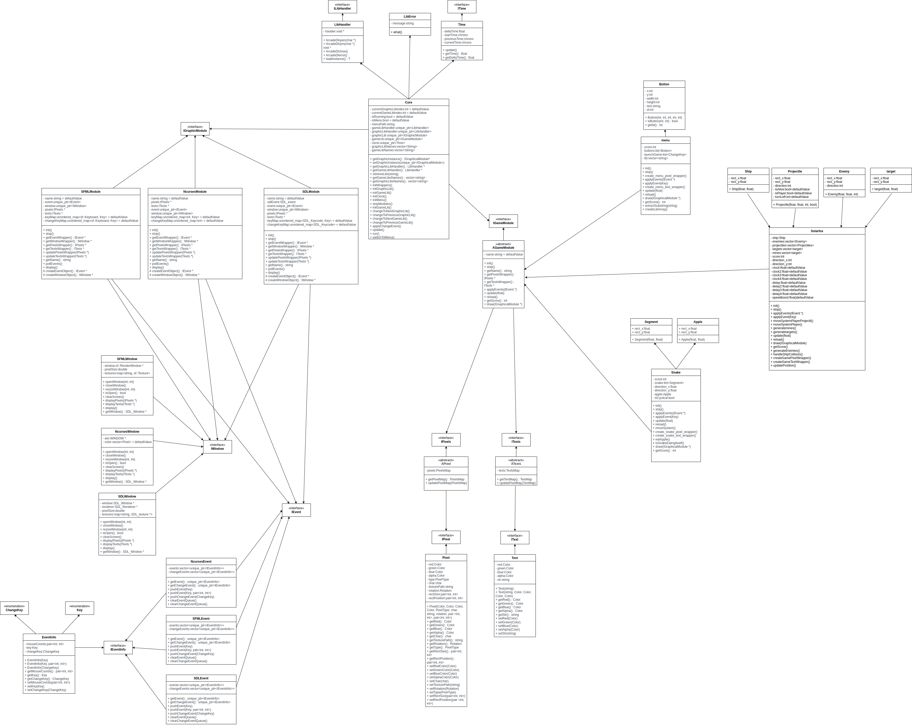

# Arcade README

Welcome to the Arcade! This project is a versatile platform that allows for the integration of different graphical and game libraries. While being in the game you can change the current working graphic library and even the game. Below you will find instructions on how to launch the project, add your own extensions, and understand the existing structure and components.

## Getting Started

### Launch Instructions

To get the project up and running on your local machine, follow these steps:

1. Create a build directory and navigate into it:
    
    mkdir build && cd build

2. Run CMake to configure the project and then build it:

    cmake .. && cmake --build .

3. To launch the project, use:

    ./arcade ./lib/{graphicalLib}

Replace `{graphicalLib}` with the graphical library you wish to use.

## Extending the Arcade

### Core System

The core manages the interactions between the graphical interface and the game logic. It contains two variables, `graphicLib` of type `IGraphicalModule` and `gameLib` of type `IGameModule`. The core system also includes its own `run` method, which facilitates the integration of selected graphical libraries and the implementation of game logic. It also has a menu wich you can change by your own using the `IGameModule` as parent.

### Adding Your Own Graphical Library

To integrate your own graphical library, ensure it inherits from the `IGraphicalModule` interface and implements all required methods. These implementations are crucial as they will be utilized by the core. Here are the key methods your graphical library needs to implement:

- `init`: A method to initialize every variable within your graphical library and to open the display window. This is essential for setting up the library.

- `stop`: This method terminates the graphical library's operations. It should ensure that all resources are properly released and that the library is cleanly stopped.

- `updatePixelsWrapper`: Takes an `IPixels` pointer as a parameter. The `IPixels` interface represents a list of pixels, each containing information such as color, character, and coordinates. This method is used to update the graphical representation on the screen.

- `updateTextsWrapper`: Takes an `ITexts` pointer as a parameter. `ITexts` is a class that encapsulates text information, including the text string itself, its color, and its coordinates on the screen. This method allows for the rendering of text within the graphical library.

- `getName`: Returns the name of the graphical library, such as "SDL2". This is used by the core system to identify the library in use.

- `pollEvent`: This method is responsible for handling events within the graphical library. It should use the library's specific event handling mechanisms to push events into the core system's event list, based on key presses or other input actions. If your library uses keys not already defined in `Keys.hpp`, you will need to add them there to ensure they are handled correctly.

- `display`: Called by the core system to display content on the screen. Your implementation should ensure that all graphical updates are rendered to the screen when this method is called.

### Adding Your Own Game Library

To add your own game library to the project, it must inherit from the `IGameModule` interface and implement its methods. This is essential for ensuring that your game can interact properly with the core and graphical libraries. Below are the key methods to implement:

- `init`: Initializes your library's variables. This method is crucial for setting up your game's initial state, loading resources, and preparing any necessary data before the game starts.

- `stop`: Stops your game library's operations. This should ensure that all resources are properly released and that the game is cleanly terminated.

- `getName`: Retrieves the name of your game. This identifier is used by the core system to list and manage the available games.

- `applyEvent`: Takes an `IEvent` as a parameter and applies the events to your game. This method is responsible for handling user input or system events and updating the game state accordingly.

- `update`: Takes a float representing the delta time since the last update call. This method is where your game's logic will be updated, including score updates, and other game mechanics.

- `reload`: This method stops and then re-initializes your game library. It can be useful for restarting the game without having to completely reload the lib.

- `getScore`: Returns the current score of the game as an integer. This allows the core to retrieve and display the score to the player.

- `draw`: Takes an `IGraphicalModule` pointer as a parameter. This method has to use the provided graphical module to render the game's visual elements on the screen. It's where you'll draw your game's sprites, text, and other graphics using the method provided by the graphical library.

### IPixel Class

The `IPixel` class define a pixel with its own set of information. This includes:

- A character representing the pixel, which is particularly useful for text-based libraries.
- A color to be displayed.
- The position of the pixel on the screen.
- The path to a texture file, if applicable.
- The size of the pixel or texture.
- Additional useful features that may be necessary for representing the pixel accurately.

`IPixel` is used as part of a list of pixels to represent the games within the project. Graphical modules utilize this list to determine what needs to be displayed on the screen. Importantly, the list of `IPixel` objects does not need to match the screen's size pixel-for-pixel, as it is expected that your implementation of the graphical library will appropriately rescale the content to fit the display area.

### IText Class

The `IText` class is designed to encapsulate textual data within the project. It is responsible for storing:

- The content of the text, which could be any string value.
- The color of the text, allowing for visual customization according to the game or the graphical module's requirements.

`IText` is used as part of a list of pixels to represent the games within the project. Graphical modules utilize this list to determine what needs to be displayed on the screen.

### IWindow Class

The `IWindow` class encapsulates some aspects of a window. Its key functionalities include:

- `isOpen()`: A method to check if the window is currently open.
- `display()`: This method is used to render the current frame to the screen.
- `open()`: Opens the window, making it visible and ready to display content.
- `close()`: Closes the window, effectively stopping the display of content.

### IEvent Class

The `IEvent` class is used for event management within the Project. It encapsulates all events, distributing them into two main categories:

- **Game Events**: A list of keys related to in-game actions. These are the inputs that directly affect the gameplay, such as moving a character or activating a game feature.
- **System Events**: A list of keys for changing the current game library, current graphical library, or returning to the main menu. The keys used for changing libraries are initially set to function keys (F1, F2, ...), but they can be customized in the `Keys.hpp` file.

### Note on UML Diagrams

For a more detailed understanding of the project architecture and the interaction between its components, please refer to the UML diagrams included with the project documentation. These diagrams provide a visual representation of the system's structure, including class hierarchies, relationships, and key interfaces.

### Adding Fonts

To add custom fonts, place them in the `font` folder.

### Adding Textures

To add custom textures:

1. Place them in the `assets` folder.
2. Append the name of your game to the file for better visibility and organization.

### Custom Libraries

Place your custom libraries in the `lib` folder and prefix them with `arcade_` to follow naming conventions.

## Existing Components

### Graphical Libraries

The project currently supports three graphical libraries:

- SFML
- SDL2
- NCurses

Ensure you have the necessary dependencies installed to use these libraries.

### Game Libraries

There are two pre-implemented games available:

- Snake
- Pacman

Additionally, there is a menu system implemented. Feel free to add your own games to the project.

